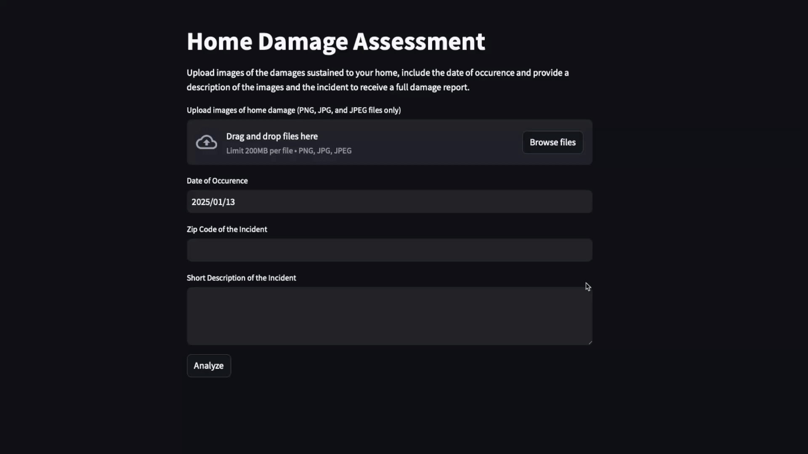

# Streamlit Application - Insurance Summary with Vision 

## Description
This simple application demonstrates a use case for Vision Large Language Models (llama3.2-vision) which accepts and allows chatting with image files.
The application accepts images of damages sustained to a home for a homeowner's insurance claim, either to be used by an agent or a policyholder to get a more comprehensive understanding of a claim. This includes understanding the weather at the time of the incident and how that may have affected the damages that may have occurred. The application also checks whether the user's description of the incident is consistent with the damages shared in the images. 

### Example Input

### Example Output with *bedroom_flood.jpg* Image

## TO DO Before Running locally on your machine
### Clone or download this repo

### Install Ollama and Models
1. Download Ollama at https://ollama.com 
2. Run `ollama pull llama3.2-vision:11b` in Terminal (for image uploading and image summaries)
3. Run `ollama pull granite3-dense:8b` in Terminal (or whatever model you'd like to do image summary comparisons and weather report)

### Get Weather API Key
1. Create Account with WeatherAPI at https://www.weatherapi.com/signup.aspx
2. Log in to account and copy API key from dashboard.
3. Paste in `weather_api_key` variable
*Note: On sign up you will be subscribed to Pro Plus plan for free, no obligation 14 day trial. After trial has ended you will be automatically switched to Free plan. The Pro Plus plan allows you to query historical weather, while the free plan does not. Keep this in mind when selecting a date in the UI as you will get an error if your plan does not allow queries on dates prior to today.*

### Install Required Packages
1. Run `pip install -r requirements.txt`
2. You're ready to run the application in your browser with `streamlit run ./insurance_streamlit_app.py`

